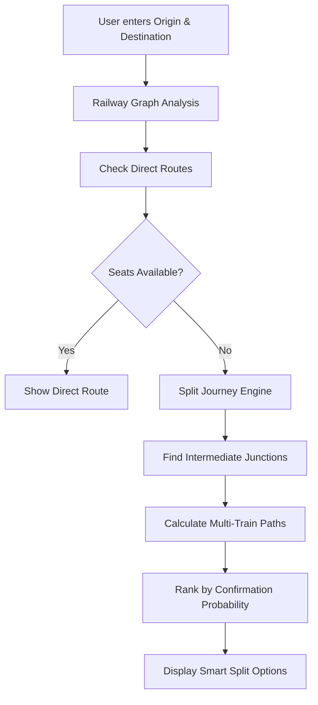

# 🚂 RailSplit - AI-Powered Railway Split Journey Discovery

<div align="center">


**Find confirmed train seats when direct tickets are unavailable by intelligently splitting journeys across intermediate stations**

[Live Demo](https://anandavnish.github.io/Rail-AI/) | [Report Bug](https://github.com/Anandavnish/Rail-AI/issues) | [Request Feature](https://github.com/Anandavnish/Rail-AI/issues)

</div>

---

## 📋 Table of Contents

- [Overview](#-overview)
- [Team](#-team)
- [Features](#-features)
- [How It Works](#-how-it-works)
- [Quick Start](#-quick-start)
- [System Architecture](#-system-architecture)
- [Technologies Used](#-technologies-used)
- [File Structure](#-file-structure)
- [Demo Features](#-demo-features)
- [Project Philosophy](#-project-philosophy)
- [Contributing](#-contributing)
- [License](#-license)

---

## 🎯 Overview

**RailSplit** is an intelligent railway journey discovery system that treats the Indian Railways network as a graph problem. When direct train tickets show "Waitlist" or "REGRET" status on IRCTC, RailSplit finds alternate paths by breaking journeys into smaller segments with confirmed seat availability.

### 🚀 Development Status

> ⚠️ **This project is currently under active development**

New features, optimizations, and improvements are being added regularly. Stay tuned for updates!

---

## 👥 Team

<table>
  <tr>
    <td align="center">
      <br />
      <sub><b>Karan Priyadarshi</b></sub><br />
      <sub>Team Leader</sub>
    </td>
    <td align="center">
      <br />
      <sub><b>Sidharth Priyadarshi</b></sub><br />
      <sub>Algorithm Design</sub>
    </td>
    <td align="center">
      <br />
      <sub><b>Anand Avnish</b></sub><br />
      <sub>Technical Development</sub>
    </td>
  </tr>
</table>

---

## ✨ Features

When IRCTC shows "Waitlist/REGRET" for direct trains, RailSplit provides:

- ✅ **Smart Journey Splitting** - Breaks your journey into optimal segments
- ✅ **Confirmed Seat Discovery** - Finds available seats via intermediate junctions
- ✅ **Multi-Train Combinations** - Suggests intelligent train transfer routes
- ✅ **Probability Ranking** - Ranks routes by confirmation probability (85-95%)
- ✅ **Detailed Breakdowns** - Complete fare and timing information
- ✅ **Graph-Based Intelligence** - Exploits quota-reset junctions and segment-wise availability
- ✅ **Responsive Design** - Works seamlessly on desktop and mobile devices

---

## 🔍 How It Works



The system treats the Indian Railways network as a graph with:
- **Nodes**: Railway stations
- **Edges**: Train connections
- **Weights**: Fare, time, and seat availability

---

## 🚀 Quick Start

### Prerequisites

- Modern web browser (Chrome, Firefox, Safari, or Edge)
- No installation required!

### Running Locally

1. **Clone the repository**
   ```bash
   git clone https://github.com/Anandavnish/Rail-AI.git
   cd Rail-AI
   ```

2. **Open in browser**
   ```bash
   # Simply open index.html in your browser
   # Or use a local server:
   python -m http.server 8000
   # Then visit: http://localhost:8000
   ```

3. **Try a demo search**
   - Origin: Delhi (NDLS)
   - Destination: Mumbai Central (BCT)
   - Discover smart split journey options!

---

## 🏗️ System Architecture

```
┌─────────────────────────────────────┐
│   Railway Graph (40+ stations)     │
│   17+ trains with real timings     │
└──────────────┬──────────────────────┘
               ↓
┌─────────────────────────────────────┐
│   Fake Inventory Engine             │
│   Realistic seat availability       │
└──────────────┬──────────────────────┘
               ↓
┌─────────────────────────────────────┐
│   Split Discovery Algorithm         │
│   Graph-based pathfinding           │
└──────────────┬──────────────────────┘
               ↓
┌─────────────────────────────────────┐
│   Beautiful Web Interface           │
│   Search + Results Display          │
└─────────────────────────────────────┘
```

---

## 💻 Technologies Used

| Technology | Purpose |
|------------|---------|
| **HTML5** | Semantic markup and structure |
| **CSS3** | Modern design with animations & glassmorphism |
| **Vanilla JavaScript** | No frameworks, pure JS implementation |
| **Graph Theory** | Custom pathfinding algorithms |
| **Responsive Design** | Mobile-first approach |

---

## 📁 File Structure

```
RailAI/
├── index.html                 # Homepage with search interface
├── results.html               # Results display page
├── styles.css                 # Global styles & animations
├── results.css                # Results page specific styles
├── js/
│   ├── railwayGraph.js       # Network data (stations & trains)
│   ├── fakeInventory.js      # Seat availability simulation
│   ├── splitEngine.js        # Core pathfinding algorithm
│   └── app.js                # UI logic & event handlers
├── IRCTC_Reference.html      # Reference material
└── README.md                 # This file
```

---

## 🎨 Demo Features

- 🎯 **Smart Route Discovery** - Via intermediate junction detection
- 📊 **Confirmation Scoring** - 85-95% probability calculations
- 💰 **Fare Breakdown** - Complete cost analysis per segment
- ⏱️ **Time Optimization** - Journey duration minimization
- 🚄 **Transfer Suggestions** - Multi-train intelligent routing
- 📱 **Fully Responsive** - Works on all device sizes
- 🎭 **Futuristic UI** - Cyberpunk-inspired design theme

---

## 🎪 For Event Presentation

**Best Demo Route**: Delhi (NDLS) → Mumbai Central (BCT)

Why this route works great for demos:
- ✨ Direct trains typically show WL (Waitlist)
- ✨ System discovers 2-3 viable split options
- ✨ All suggestions have high confirmation probability
- ✨ Showcases the full power of the algorithm

---

## 💡 Project Philosophy

> **"You're not building a ticket site. You're building an intelligent railway survival system."**

This system treats Indian Railways as a graph problem, exploiting:
- 🔄 **Quota-reset junctions** - Stations where quotas refresh
- 📍 **Segment-wise availability** - Seats available for partial routes
- 🎯 **Intelligent pathfinding** - Finding seats that appear "unavailable" in traditional searches
- 🧠 **Smart algorithms** - Graph theory meets real-world railway logistics

---

## 🤝 Contributing

Contributions are what make the open-source community an amazing place to learn, inspire, and create. Any contributions you make are **greatly appreciated**.

1. Fork the Project
2. Create your Feature Branch (`git checkout -b feature/AmazingFeature`)
3. Commit your Changes (`git commit -m 'Add some AmazingFeature'`)
4. Push to the Branch (`git push origin feature/AmazingFeature`)
5. Open a Pull Request

---

## 📄 License

This project is licensed under the MIT License - see the LICENSE file for details.

---

## 🙏 Acknowledgments

- Built for railway enthusiasts, travelers, and event demonstration
- Inspired by the challenges of Indian Railways booking system
- **Not affiliated with IRCTC or Indian Railways**

---

<div align="center">

**Made with ❤️ by the RailSplit Team**

⭐ Star this repository if you find it helpful!

[Report Bug](https://github.com/Anandavnish/Rail-AI/issues) · [Request Feature](https://github.com/Anandavnish/Rail-AI/issues)

</div>
